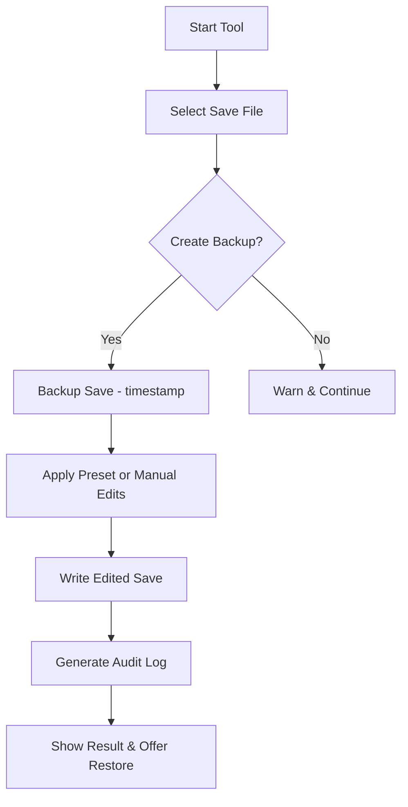

# Football Manager Money Hack — Instant Club Finance Tool for PC ⚽

A compact, easy-to-use tool for managers who want to experiment with budgets, test tactics, or prototype squads without grinding seasons. **Football Manager Money Hack** is a local save-editor and config-driven utility that lets you modify club finances, transfer budgets, and wage funds in single-player saves — fast, reversible, and designed for offline use only.

---

## Overview

This tool targets Football Manager (FM) save files and offers:

* Safe save backups and a one-click restore system.
* Templates to add transfer funds, adjust wage budgets, or set club debt to desired levels.
* A sandbox mode for testing finances without risking your main career.

Built for PC (Windows) and tested on the latest FM releases, the utility focuses on **transparency** and **reversibility**: every edit is logged and reversible.

> [!WARNING]
> Use only on single-player saves. Modifying saves to gain an unfair advantage in multiplayer, online competitions, or against anti-cheat measures may violate game terms and lead to bans. This project promotes responsible, offline experimentation.

---

## Features

* **Save Auto-Backup** — Every edit creates a timestamped backup so you can revert instantly.
* **Preset Templates** — “Beginner Boost”, “Financial Freedom”, “Experimental Loan” presets for one-click finance changes.
* **Fine-Grain Editors** — Manually edit balance, transfer budget, wage budget, and debt entries.
* **Batch Mode** — Apply the same change across multiple saves (useful for sandbox testing).
* **Audit Log** — Full JSON log of before/after values for traceability.
* **Portable** — Small footprint, no installation required — drop in a folder and run.

---

## Compatibility

| Game / Platform             | Supported       | Notes                                                    |
| --------------------------- | --------------- | -------------------------------------------------------- |
| Football Manager (Steam)    | ✅ Yes           | Auto-detects save folder                                 |
| Football Manager (Epic/GOG) | ✅ Yes           | Manual path selection supported                          |
| Linux / Proton              | ⚠️ Experimental | Use with compatibility layer; manual save paths required |
| macOS                       | ⚠️ Partial      | Use with Wine or VM; native support TBD                  |

> [!NOTE]
> Always run the editor with the game closed. Editing a save that the game currently has open risks corruption.

---

## Quick Setup (Windows)

1. Download `fm-money-hack.zip` and extract to a safe folder.
2. Run `FMMoneyTool.exe` (Windows Defender may require a one-time allow).
3. Click **Load Save** and pick a `.fm` or `.fmf` save file.
4. Choose a preset (e.g., *Financial Freedom*) or open **Advanced Edit**.
5. Click **Apply** → tool creates a backup → edits the selected fields → shows an audit.
6. Start Football Manager and load the edited save.

```powershell
# Example: bulk-edit script (PowerShell)
Get-ChildItem "C:\Users\You\Documents\Sports Interactive\Football Manager\2025\saves" -Filter "*.fm" |
ForEach-Object {
  .\FMMoneyTool.exe --batch --file "$($_.FullName)" --set "transfer_budget=50000000"
}
```

---

## Example Presets & Config Snippets

**Beginner Boost** (JSON preset)

```json
{
  "name": "Beginner Boost",
  "transfer_budget": 25000000,
  "wage_budget": 500000,
  "club_balance": 100000000
}
```

**Financial Freedom** (manual quick-change)

* Transfer budget: £50,000,000
* Wage budget: £1,000,000 per week
* Club debt: 0

---

## Internal Flow (Mermaid)



---

## Safety & Ethics

* The tool is explicitly for **single-player, offline** experimentation, testing tactics, or learning FM economics without long playtime.
* Do **not** distribute edited saves as competitive submissions or use them in online leagues.
* Keep backups — the tool makes them, but local good practices matter.

---

## FAQ

**Q: Will this get me banned?**
A: When used only for offline saves, it should not trigger bans. Using modified files to cheat in online competitions or shared leaderboards risks account action.

**Q: Are my saves corrupted after editing?**
A: The tool writes edits in a verified structure and always creates backups. Corruption risk is minimal if you close the game before editing.

**Q: Can I automate fundraising each matchday?**
A: Use the Batch Mode or scheduled scripts to create test saves with different budgets, but avoid automating interactions with online services.

**Q: Is the tool detectable by anti-cheat?**
A: The tool does not inject into the running game. It modifies save files while the game is closed. Injection or memory editing is intentionally out of scope to reduce detection risk.

**Q: Can I modify player attributes too?**
A: Current release focuses on finance. Player attribute editing is planned for a future release as an optional module (with clear safeguards).

---

## Troubleshooting

* Overlay not appearing: Make sure the game is closed and you’ve selected the correct save folder.
* Save not recognized: Double-check file extension and FM version compatibility. Use the “Scan Folder” option.
* Windows blocks exe: Right-click → Properties → Unblock, then run.

---

## Final Thoughts & Downloads

**Football Manager Money Hack** is a focused, reversible, and transparent tool to explore FM finances without the grind. Ideal for content creators, tactic testers, and curious managers who want to prototype club strategies quickly.
